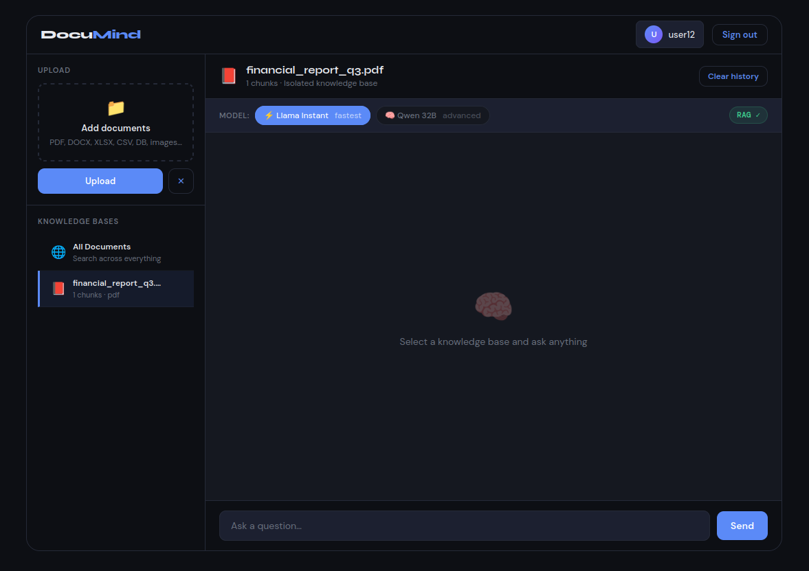
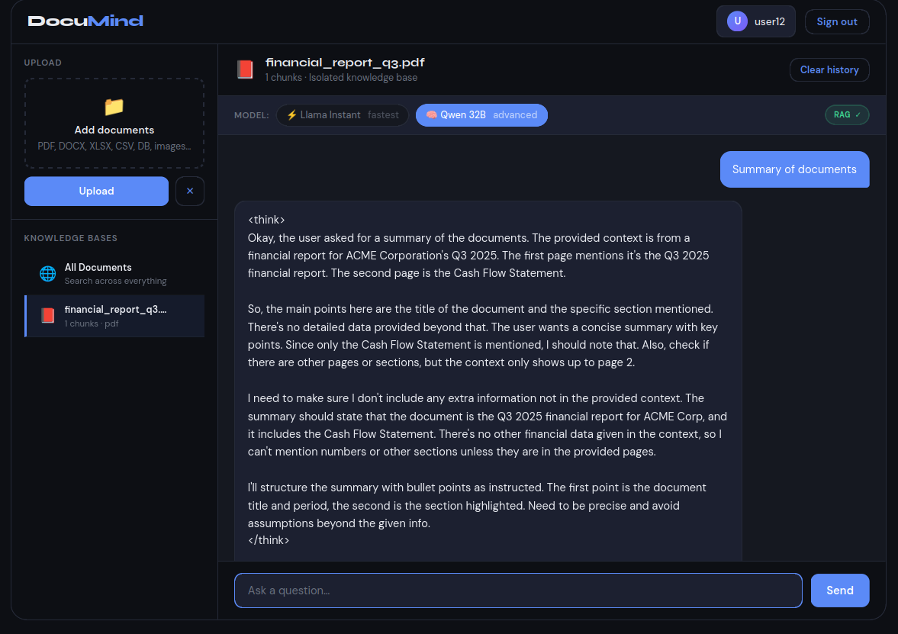
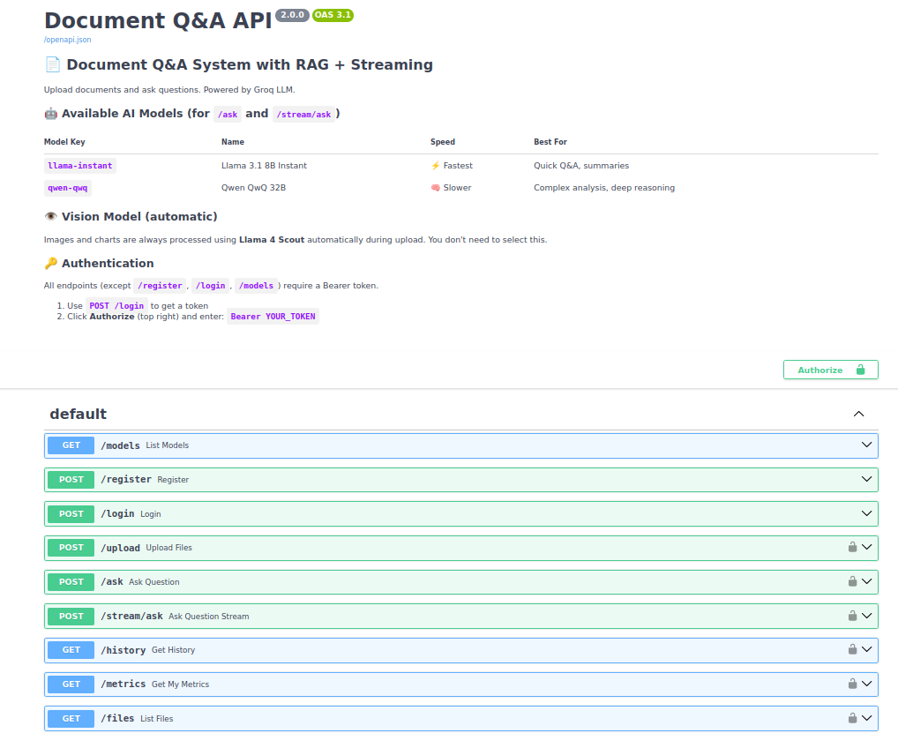

<div align="center">

<br>


### 🧠 Chat With Any Document. Powered by AI.

<p align="center">
<em>Upload a PDF, Excel, Word, image, or database — ask anything in plain English.</em><br>
<em>Get instant, context-aware answers grounded in your own files.</em>
</p>

<br>

<p align="center">
<a href="https://www.python.org/"></a>
<a href="https://fastapi.tiangolo.com/"></a>
<a href="https://groq.com/"></a>
<a href="https://github.com/facebookresearch/faiss"></a>
<a href="LICENSE"></a>
</p>

<p align="center">


</p>

<br>

<p align="center">
<a href="#-quick-start">🚀 Quick Start</a> •
<a href="#-features">✨ Features</a> •
<a href="#-screenshots">📸 Screenshots</a> •
<a href="#-api-reference">📡 API</a> •
<a href="#-tech-stack">🛠️ Stack</a>
</p>

<br>

</div>

---

## 💡 What is DocuMind?

> **DocuMind** turns any document into a conversation.
> Drop in a PDF, spreadsheet, slide deck, or image — DocuMind reads it end-to-end (text, tables, charts, and even scanned pages), indexes it into a semantic vector store, and lets you ask questions in plain English.
>
> Answers are fast, grounded in your actual content, and come with source citations.

<br>

<div align="center">

### 🎯 Why DocuMind?

</div>

<table>
<tr>
<td width="33%" align="center">
<h3>⚡ Fast</h3>
<p>Groq's ultra-low-latency LLMs stream word-by-word answers in real time.</p>
</td>
<td width="33%" align="center">
<h3>🎯 Accurate</h3>
<p>RAG retrieves the most relevant chunks and grounds every answer in your documents.</p>
</td>
<td width="33%" align="center">
<h3>🔒 Private</h3>
<p>Every user's data is isolated. Your files stay yours.</p>
</td>
</tr>
</table>

---

## 📸 SneakPeaks

> 📁 Place screenshots in **`assets/screenshots/`** — they appear below automatically.

<br>

<div align="center">

### 🔐 Authentication

<table>
<tr>
<td align="center" width="50%">
<br>
<b>Login</b>
</td>
<td align="center" width="50%">
<br>
<b>Register</b>
</td>
</tr>
</table>

<br>

### 💬 Core Workflow

<table>
<tr>
<td align="center" width="50%">
<br>
<b>Upload Documents</b>
</td>
<td align="center" width="50%">
<br>
<b>Chat with Documents</b>
</td>
</tr>
</table>

<br>

### 📡 API Playground

<br>
<b>Swagger Interactive Docs</b>

</div>

---

## ✨ Features

<table>
<tr>
<td width="50%" valign="top">

### 📄 Document Intelligence
- **9+ file formats** — PDF, DOCX, PPTX, XLSX, CSV, TXT, ODT, images, SQLite
- **👁️ Vision understanding** — Charts & images auto-described by Llama 4 Scout
- **🔍 OCR fallback** — Scanned pages extracted via Tesseract
- **📊 Table-aware** — Extracts Word tables, Excel sheets, DB rows

</td>
<td width="50%" valign="top">

### 🧠 AI-Powered Q&A
- **RAG pipeline** — Semantic search → prompt → LLM
- **⚡ Real-time streaming** — Word-by-word SSE responses
- **🤖 Two chat models** — Fast or Advanced reasoning
- **📚 Context-aware** — Last 20 messages preserved per file

</td>
</tr>
<tr>
<td width="50%" valign="top">

### 🔐 Multi-User & Secure
- **Bearer token auth** on all protected routes
- **User-level isolation** — Every chunk tagged with `user_id`
- **File-level isolation** — Query one file or all together
- **Per-user chat history** — Never mixed across users

</td>
<td width="50%" valign="top">

### 📊 Full Observability
- **Latency** tracked per query (ms)
- **Token usage** — Input, output, total
- **Relevance score** — Cosine similarity 0–1
- **Source citations** — Know which file answered
- **Swagger UI** — Full interactive API docs

</td>
</tr>
</table>

---

## 🚀 Quick Start

<details open>
<summary><b>📦 Install in 4 steps</b></summary>

<br>

```bash
# 1️⃣  Clone the repo
git clone https://github.com/your-username/DocuMind.git
cd DocuMind

# 2️⃣  Set up virtual environment
python -m venv venv
source venv/bin/activate          # macOS / Linux
# venv\Scripts\activate           # Windows

# 3️⃣  Install dependencies
pip install -r requirements.txt

# 4️⃣  Add your Groq API key
cp .env.example .env
# Open .env and set:
# SECRET_KEY=your_groq_api_key_here
```

> 🔑 Get a free Groq API key at **[console.groq.com/keys](https://console.groq.com/keys)**

</details>

<details>
<summary><b>⚙️ Prerequisites</b></summary>

<br>

| Requirement | Version | Install |
|---|---|---|
| Python | 3.10+ | [python.org](https://www.python.org/) |
| Tesseract OCR | Any | `apt install tesseract-ocr` / `brew install tesseract` |
| Groq API Key | — | [console.groq.com/keys](https://console.groq.com/keys) |

</details>

<details>
<summary><b>▶️ Run the server</b></summary>

<br>

```bash
uvicorn main:app --reload
```

| Service | URL |
|---|---|
| 🌐 REST API | `http://127.0.0.1:8000` |
| 📘 Swagger UI | `http://127.0.0.1:8000/docs` |
| 📗 ReDoc | `http://127.0.0.1:8000/redoc` |

</details>

---

## 🛠️ Tech Stack

<div align="center">

| Layer | Technology |
|:-:|:--|
| 🎯 **Framework** | FastAPI + Uvicorn |
| 🤖 **LLM Provider** | Groq |
| 💬 **Chat Models** | Llama 3.1 8B Instant · Qwen 3 32B |
| 👁️ **Vision Model** | Llama 4 Scout 17B |
| 🔢 **Embeddings** | `all-MiniLM-L6-v2` (384-dim) |
| 🧮 **Vector Store** | FAISS `IndexFlatL2` |
| 🔤 **OCR** | Tesseract + Pytesseract |
| 📄 **Parsers** | PyMuPDF · python-docx · python-pptx · pandas · openpyxl · odfpy |
| 💾 **Database** | SQLite |
| 🔑 **Auth** | HTTP Bearer Token |
| 📡 **Streaming** | Server-Sent Events (SSE) |

</div>

---

## 🏗️ Architecture

```
                    ┌──────────────────────────────────┐
                    │    Client (UI / Swagger / curl)  │
                    └──────────────┬───────────────────┘
                                   │  HTTP + SSE
                    ┌──────────────▼───────────────────┐
                    │         FastAPI Router           │
                    │                                  │
                    │   /register /login /upload       │
                    │   /ask /stream/ask /files        │
                    │   /history /metrics /models      │
                    └──┬───────────────────────┬───────┘
                       │                       │
                ┌──────▼──────┐         ┌──────▼──────┐
                │   SQLite    │         │    FAISS    │
                │  • users    │         │  • vectors  │
                │  • tokens   │         │  • chunks   │
                │  • history  │         │  • metadata │
                │  • metrics  │         └─────────────┘
                └─────────────┘

 ┌─ UPLOAD FLOW ──────────────────────────────────────────────────┐
 │ File → Loader → Text+Images → Chunker(500) → Embedder → FAISS  │
 └────────────────────────────────────────────────────────────────┘

 ┌─ QUERY FLOW ───────────────────────────────────────────────────┐
 │ Q → Embed → FAISS(top5) → Prompt → Groq LLM → Answer (SSE)    │
 └────────────────────────────────────────────────────────────────┘
```

---

## 📂 Project Structure

```
DocuMind/
│
├── 🚀 main.py                # Entry point
├── 📦 requirements.txt
├── 🔐 .env                   # Your secrets (gitignored)
├── 📋 .env.example
│
├── 📁 scripts/
│   ├── api.py                # FastAPI routes
│   ├── chat.py               # Blocking Q&A + metrics
│   ├── loader.py             # Multi-format document parser
│   ├── models.py             # Model registry
│   ├── processor.py          # Chunking + FAISS
│   ├── prompts.py            # Prompt templates
│   ├── vision.py             # Llama 4 Scout vision
│   ├── db.py                 # SQLite helpers
│   └── log.py
│
├── 📁 streaming/
│   └── chat.py               # SSE generator
│
├── 📁 docs/                  # Uploaded files
├── 📁 vectorstore/           # FAISS index + chunks
├── 📁 database/
│   └── users.db
├── 📁 logs/
└── 📁 assets/
    └── screenshots/          # UI screenshots
```

---

## 📡 API Reference

<div align="center">

### 🔐 Authentication

| Method | Endpoint | Description | Auth |
|:-:|:--|:--|:-:|
| `POST` | `/register` | Create new account | 🌐 |
| `POST` | `/login` | Get Bearer token | 🌐 |

### 📄 Documents

| Method | Endpoint | Description | Auth |
|:-:|:--|:--|:-:|
| `POST` | `/upload` | Upload one or more files | 🔒 |
| `GET` | `/files` | List your uploaded files | 🔒 |

### 💬 Question & Answer

| Method | Endpoint | Description | Auth |
|:-:|:--|:--|:-:|
| `POST` | `/ask` | Full blocking response | 🔒 |
| `POST` | `/stream/ask` | Real-time SSE stream | 🔒 |

### 📊 History & Metrics

| Method | Endpoint | Description | Auth |
|:-:|:--|:--|:-:|
| `GET` | `/history` | Chat history | 🔒 |
| `GET` | `/metrics` | Per-query performance | 🔒 |
| `GET` | `/models` | Available AI models | 🌐 |

> 🌐 = Public · 🔒 = Requires `Authorization: Bearer YOUR_TOKEN`

</div>

---

## 🎬 Usage Example

<details open>
<summary><b>💻 Complete workflow in 4 commands</b></summary>

<br>

**1️⃣ Register**
```bash
curl -X POST http://localhost:8000/register \
  -H "Content-Type: application/json" \
  -d '{"username": "alice", "password": "secret123"}'
```

**2️⃣ Login → get token**
```bash
curl -X POST http://localhost:8000/login \
  -H "Content-Type: application/json" \
  -d '{"username": "alice", "password": "secret123"}'
# → {"token": "YOUR_TOKEN", ...}
```

**3️⃣ Upload**
```bash
curl -X POST http://localhost:8000/upload \
  -H "Authorization: Bearer YOUR_TOKEN" \
  -F "files=@report.pdf"
```

**4️⃣ Ask**
```bash
curl -X POST http://localhost:8000/ask \
  -H "Authorization: Bearer YOUR_TOKEN" \
  -H "Content-Type: application/json" \
  -d '{"question": "What are the key findings?", "model": "llama-instant"}'
```

</details>

<details>
<summary><b>⚡ Streaming example (SSE)</b></summary>

<br>

```bash
curl -X POST http://localhost:8000/stream/ask \
  -H "Authorization: Bearer YOUR_TOKEN" \
  -H "Content-Type: application/json" \
  -d '{"question": "Summarize the financial highlights", "model": "qwen-qwq"}'
```

SSE events received:
```
data: {"type": "meta",  "sources": ["report.pdf"], "relevance_score": 0.87}
data: {"type": "chunk", "content": "The financial"}
data: {"type": "chunk", "content": " highlights show..."}
data: {"type": "done",  "full_answer": "The financial highlights show..."}
```

</details>

---

## 🤖 AI Models

<div align="center">

### 💬 Chat Models *(user-selectable)*

| Key | Model | Speed | Best For |
|:--|:--|:-:|:--|
| 🏃 `llama-instant` *(default)* | Llama 3.1 8B Instant | ⚡⚡⚡ | Quick Q&A, summaries |
| 🧠 `qwen-qwq` | Qwen 3 32B | ⚡ | Deep reasoning, analysis |

### 👁️ Vision Model *(automatic)*

| Model | Used For |
|:--|:--|
| 🔭 Llama 4 Scout 17B | Auto-describes every image, chart, and diagram in your docs |

</div>

---

## 📚 Supported File Types

<div align="center">

| Category | Formats |
|:-:|:--|
| 📄 **Documents** | `.pdf` · `.docx` · `.odt` · `.txt` |
| 📊 **Spreadsheets** | `.xlsx` · `.xls` · `.csv` |
| 🎬 **Presentations** | `.pptx` |
| 🖼️ **Images** | `.png` · `.jpg` · `.jpeg` · `.bmp` · `.tiff` |
| 💾 **Databases** | `.db` *(SQLite)* |

</div>

---

## 📊 Metrics

Every query automatically logs:

| Field | What it means |
|:--|:--|
| ⏱️ `latency_ms` | End-to-end response time |
| 📥 `input_tokens` | Tokens sent to the LLM |
| 📤 `output_tokens` | Tokens in the answer |
| 🔢 `total_tokens` | Combined token usage |
| 🎯 `relevance_score` | Cosine similarity of query vs retrieved chunks (0–1) |
| ✏️ `answer_length` | Character count of the answer |

<br>

> 🎯 **Relevance score guide**
> `0.0–0.35` → Low match · `0.35–0.60` → ✅ Good (normal for `all-MiniLM-L6-v2`) · `0.60–1.0` → 💯 Strong match

---

## 🔧 Environment Variables

| Variable | Required | Description |
|:--|:-:|:--|
| `SECRET_KEY` | ✅ | Your Groq API key → [console.groq.com/keys](https://console.groq.com/keys) |

---

## 🗺️ Roadmap

- [ ] 🔑 Token expiry & refresh flow
- [ ] ⚡ Query result caching
- [ ] 📤 Export chat to PDF / DOCX
- [ ] ☁️ Google Drive / S3 integration
- [ ] 📊 Admin monitoring dashboard
- [ ] 🚦 Per-user rate limiting
- [ ] 🐘 PostgreSQL production support
- [ ] 🌍 Multi-language documents

---

## 🤝 Contributing

Contributions are welcome! Here's how:

```bash
# 1. Fork & clone
# 2. Create a feature branch
git checkout -b feature/amazing-feature

# 3. Commit your changes
git commit -m "Add amazing feature"

# 4. Push & open a PR
git push origin feature/amazing-feature
```

---

## 📄 License

Released under the **MIT License** — see [LICENSE](LICENSE) for details.

---

## 🙏 Acknowledgements

<div align="center">

Built on the shoulders of giants:

[**FAISS**](https://github.com/facebookresearch/faiss) · [**Groq**](https://groq.com/) · [**Sentence Transformers**](https://www.sbert.net/) · [**FastAPI**](https://fastapi.tiangolo.com/) · [**PyMuPDF**](https://pymupdf.readthedocs.io/)

</div>

---

<div align="center">

<br>

### ⭐ If DocuMind helped you, please star the repo! ⭐

<br>

**Crafted with ❤️ by [Deep Malviya](https://github.com/your-username)**

<br>


</div>
