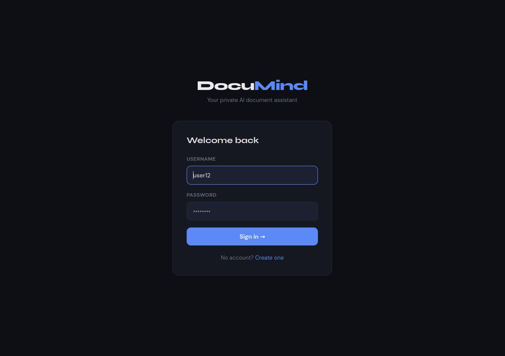
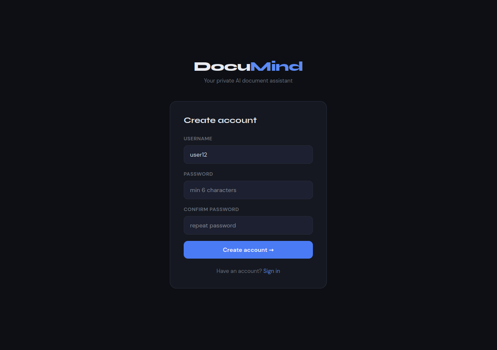

<div align="center">

# DocuMind

### AI-Powered Document Question Answering

Upload any document. Ask anything. Get instant answers.

[](https://www.python.org/)
[](https://fastapi.tiangolo.com/)
[](https://groq.com/)
[](https://github.com/facebookresearch/faiss)
[](LICENSE)

</div>

---

## What is DocuMind?

**DocuMind** is an AI-powered document Q&A system. Upload a PDF, Word file, Excel sheet, PowerPoint, image, CSV, or SQLite database — then ask questions about it in plain English. DocuMind uses **RAG (Retrieval-Augmented Generation)** to find the most relevant parts of your documents and generate accurate, context-aware answers using Groq's ultra-fast LLMs.

---

## Screenshots

> Add your screenshots to `assets/screenshots/` — they will display here automatically.

<br>

**Login & Register**

| Login Page | Register Page |
|:-:|:-:|
|  |  |

<br>

**Core Workflow**

| Upload Documents | Chat with Documents |
|:-:|:-:|
|  |  |

<br>

**API**

| Swagger API Docs |
|:-:|
|  |

---

## Features

| | Feature | Description |
|:-:|---|---|
| 📄 | **Multi-format ingestion** | PDF, DOCX, PPTX, XLSX, CSV, TXT, ODT, images, SQLite `.db` |
| 👁️ | **Vision understanding** | Images and charts inside documents are auto-described using Llama 4 Scout |
| 🔍 | **OCR fallback** | Scanned PDF pages processed with Tesseract — no content missed |
| 🧠 | **RAG pipeline** | Semantic chunking → embedding → FAISS vector search → LLM generation |
| ⚡ | **Streaming responses** | Word-by-word real-time answers via Server-Sent Events (SSE) |
| 📁 | **Per-file knowledge bases** | Each file gets its own isolated vector space and chat history |
| 🔒 | **Multi-user auth** | Register, login, Bearer token — full user-level data isolation |
| 📊 | **Metrics logging** | Every query logs latency, token usage, and relevance score |
| 🤖 | **Two chat models** | Fast (Llama 3.1 8B) or Advanced reasoning (Qwen 3 32B) |

---

## Tech Stack

| Layer | Technology |
|---|---|
| **Backend** | FastAPI + Uvicorn |
| **LLM Provider** | Groq API |
| **Chat Models** | Llama 3.1 8B Instant · Qwen 3 32B |
| **Vision Model** | Llama 4 Scout 17B |
| **Embeddings** | `sentence-transformers` — `all-MiniLM-L6-v2` (384-dim) |
| **Vector Store** | FAISS `IndexFlatL2` |
| **OCR** | Tesseract + Pytesseract |
| **Document Parsing** | PyMuPDF · python-docx · python-pptx · pandas · openpyxl · odfpy · Pillow |
| **Database** | SQLite |
| **Auth** | HTTP Bearer Token |
| **Streaming** | Server-Sent Events (SSE) |

---

## Architecture

```
┌─────────────────────────────────────────────────────┐
│              Client  (UI / Swagger / curl)           │
└────────────────────────┬────────────────────────────┘
                         │  HTTP / SSE
┌────────────────────────▼────────────────────────────┐
│                 FastAPI  (api.py)                    │
│  /register  /login  /upload  /ask  /stream/ask      │
│  /files     /history  /metrics  /models             │
└──────────┬─────────────────────┬────────────────────┘
           │                     │
     ┌─────▼──────┐        ┌─────▼──────┐
     │  SQLite DB │        │   FAISS    │
     │  users     │        │   Vector   │
     │  tokens    │        │   Store    │
     │  history   │        └────────────┘
     │  metrics   │
     └────────────┘

Upload Flow:
  File ──► Loader ──► Text + Images ──► Chunker (500 chars)
       ──► Embedder (all-MiniLM-L6-v2) ──► FAISS Index

Query Flow:
  Question ──► Embed ──► FAISS Search (top 5)
           ──► Prompt (system + history + context)
           ──► Groq LLM ──► Answer  [blocking or SSE]
```

---

## Project Structure

```
DocuMind/
├── main.py                  # Entry point
├── requirements.txt
├── .env                     # Secrets (never committed)
├── .env.example             # Template
│
├── scripts/
│   ├── api.py               # All FastAPI routes
│   ├── chat.py              # Blocking Q&A + metrics
│   ├── loader.py            # Multi-format document parser
│   ├── models.py            # LLM model registry
│   ├── processor.py         # Chunking + FAISS vector store
│   ├── prompts.py           # Prompt templates
│   ├── vision.py            # Groq vision (Llama 4 Scout)
│   ├── db.py                # SQLite helpers
│   └── log.py               # Logging
│
├── streaming/
│   └── chat.py              # Streaming SSE generator
│
├── docs/                    # Uploaded files (auto-created)
├── vectorstore/             # FAISS index + chunks (auto-created)
├── database/
│   └── users.db             # SQLite DB (auto-created)
├── logs/
└── assets/
    └── screenshots/         # UI screenshots live here
```

---

## Prerequisites

- Python **3.10+**
- **Tesseract OCR** installed
- A free **Groq API key** from [console.groq.com/keys](https://console.groq.com/keys)

**Install Tesseract:**

```bash
# Ubuntu / Debian
sudo apt install tesseract-ocr

# macOS
brew install tesseract

# Windows — download from https://github.com/UB-Mannheim/tesseract/wiki
```

---

## Installation

```bash
# 1. Clone
git clone https://github.com/your-username/DocuMind.git
cd DocuMind

# 2. Create virtual environment
python -m venv venv
source venv/bin/activate        # macOS / Linux
# venv\Scripts\activate         # Windows

# 3. Install dependencies
pip install -r requirements.txt

# 4. Set up environment
cp .env.example .env
# Open .env and add your Groq API key
```

`.env`:
```
SECRET_KEY=your_groq_api_key_here
```

---

## Running the Server

```bash
uvicorn main:app --reload
```

| URL | What you get |
|---|---|
| `http://127.0.0.1:8000` | REST API |
| `http://127.0.0.1:8000/docs` | Interactive Swagger UI |
| `http://127.0.0.1:8000/redoc` | ReDoc docs |

---

## API Reference

### Auth

| Method | Endpoint | Description |
|---|---|---|
| `POST` | `/register` | Create account |
| `POST` | `/login` | Login → get Bearer token |

### Documents

| Method | Endpoint | Description |
|---|---|---|
| `POST` | `/upload` | Upload one or more files |
| `GET` | `/files` | List your uploaded files |

### Q&A

| Method | Endpoint | Description |
|---|---|---|
| `POST` | `/ask` | Ask — full blocking response |
| `POST` | `/stream/ask` | Ask — real-time SSE stream |

### History & Metrics

| Method | Endpoint | Description |
|---|---|---|
| `GET` | `/history` | Chat history |
| `GET` | `/metrics` | Per-query performance logs |
| `GET` | `/models` | Available AI models |

> All endpoints except `/register`, `/login`, and `/models` require `Authorization: Bearer YOUR_TOKEN`.

---

## Quick Usage

```bash
# Register
curl -X POST http://localhost:8000/register \
  -H "Content-Type: application/json" \
  -d '{"username": "alice", "password": "secret123"}'

# Login
curl -X POST http://localhost:8000/login \
  -H "Content-Type: application/json" \
  -d '{"username": "alice", "password": "secret123"}'
# → {"token": "YOUR_TOKEN"}

# Upload
curl -X POST http://localhost:8000/upload \
  -H "Authorization: Bearer YOUR_TOKEN" \
  -F "files=@report.pdf"

# Ask
curl -X POST http://localhost:8000/ask \
  -H "Authorization: Bearer YOUR_TOKEN" \
  -H "Content-Type: application/json" \
  -d '{"question": "What are the key findings?", "model": "llama-instant"}'

# Stream
curl -X POST http://localhost:8000/stream/ask \
  -H "Authorization: Bearer YOUR_TOKEN" \
  -H "Content-Type: application/json" \
  -d '{"question": "Summarize the highlights", "model": "qwen-qwq"}'
```

---

## AI Models

### Chat Models

| Key | Model | Speed | Best For |
|---|---|---|---|
| `llama-instant` *(default)* | Llama 3.1 8B Instant | Fastest | Quick Q&A, summaries |
| `qwen-qwq` | Qwen 3 32B | Slower | Complex analysis, deep reasoning |

### Vision Model *(automatic)*

| Model | Used For |
|---|---|
| Llama 4 Scout 17B | Auto-describes every image and chart found during upload |

---

## Supported File Types

| Format | Extensions |
|---|---|
| PDF | `.pdf` |
| Word | `.docx` |
| PowerPoint | `.pptx` |
| Excel | `.xlsx` `.xls` |
| CSV | `.csv` |
| Plain Text | `.txt` |
| OpenDocument | `.odt` |
| Images | `.png` `.jpg` `.jpeg` `.bmp` `.tiff` |
| SQLite | `.db` |

---

## Metrics Explained

Every query logs:

| Field | Description |
|---|---|
| `latency_ms` | End-to-end response time |
| `input_tokens` | Tokens sent to the LLM |
| `output_tokens` | Tokens in the answer |
| `total_tokens` | Total token usage |
| `relevance_score` | Cosine similarity between query and retrieved chunks (0–1) |
| `answer_length` | Character count of the answer |

**Relevance score:** `0.35–0.60` is the normal, healthy range for `all-MiniLM-L6-v2`.

---

## Environment Variables

| Variable | Required | Description |
|---|---|---|
| `SECRET_KEY` | Yes | Groq API key from [console.groq.com/keys](https://console.groq.com/keys) |

---

## Roadmap

- [ ] Token expiry and refresh
- [ ] Query result caching
- [ ] Export chat as PDF / DOCX
- [ ] Google Drive / S3 integration
- [ ] Admin monitoring panel
- [ ] Rate limiting per user
- [ ] PostgreSQL support for production

---

## Contributing

1. Fork the repo
2. Create a branch: `git checkout -b feature/your-feature`
3. Commit: `git commit -m "Add your feature"`
4. Push: `git push origin feature/your-feature`
5. Open a Pull Request

---

## License

MIT License — see [LICENSE](LICENSE) for details.

---

## Acknowledgements

[FAISS](https://github.com/facebookresearch/faiss) · [Groq](https://groq.com/) · [Sentence Transformers](https://www.sbert.net/) · [FastAPI](https://fastapi.tiangolo.com/) · [PyMuPDF](https://pymupdf.readthedocs.io/)

---

<div align="center">

Built by **Deep Malviya**

</div>
